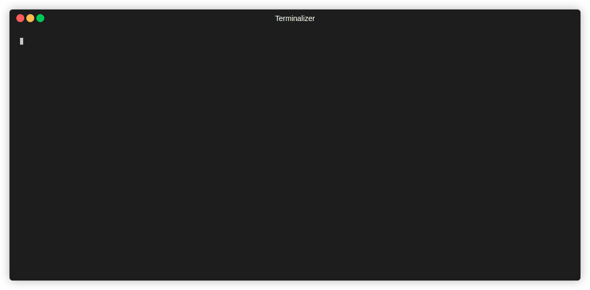

# Karmada Migration Playbook

This playbook (`playbooks/migrate.yml`) automates the migration of nodes from a MicroK8s-based Chutes deployment to a Karmada-based K3s deployment. It handles the complete migration workflow including node removal, system reset, setup, and re-registration.

## Overview

The migration process transforms your infrastructure from MicroK8s to Karmada/K3s while preserving node information and ensuring a smooth transition with minimal downtime.

### Process Overview

1. **Sets up the Karmada control plane** on designated control nodes
2. **Migrates worker nodes** from MicroK8s to K3s/Karmada in a controlled manner
3. **Preserves node metadata** (GPU types, costs) during migration
4. **Handles failure scenarios** with migration markers to prevent re-processing

## Prerequisites

### Infrastructure Requirements

- **Control plane node**: A dedicated node to run the Karmada control plane
- **Microk8s nodes**: Existing MicroK8s nodes to be migrated
- **Network connectivity**: All nodes must have a public IP
- **SSH access**: Ansible must have sudo access to all nodes

### Software Requirements

- Ansible 2.15+
- Python 3.x
- `chutes-miner-cli` package (installed automatically)
- Bittensor hotkey for existing microk8s cluster

### Configuration Files

- **Inventory file**: `inventory.yml` with proper node groupings
- **Hotkey file**: Valid Bittensor wallet hotkey
- **Variables**: Configuration in `vars/migrate.yml`

## Inventory Structure

Your `inventory.yml` should define these groups:

```yaml
all:
  children:
    control:
      hosts:
        chutes-miner-cpu-0:
          ansible_host: 10.0.0.1
    workers:
      hosts:
        chutes-miner-gpu-0:
          ansible_host: 10.0.0.2
        chutes-miner-gpu1:
          ansible_host: 10.0.0.3
    microk8s:  # Existing MicroK8s control plane
      hosts:
        chutes-miner-control-0: # Note the naming convention.
          ansible_host: 10.0.0.2
```
**IMPORTANT: Note the naming convention for the microk8s group.  This ensures the name does not conflict with the new control host**

## Configuration Variables

### Core Variables (`vars/migrate.yml`)

```yaml
# CLI execution location
run_cli_locally: false  # Set to true to run chutes-miner commands from Ansible controller

# Hotkey configuration
hotkey_path: ~/.bittensor/wallets/chutes-test/hotkeys/chutes-test # Path to hotkey on controller
remote_hotkey_path: /etc/chutes-miner/hotkey.json # Path on host if running CLI remotely
copy_hotkey_to_ansible_host: false # If running CLI from ansible hosts, set to true

# API configuration
miner_api_port: 32000  # Node port to use for miner API if running from ansible controller
```

### Auto-Generated Variables

The playbook automatically generates `vars/chutes_nodes.yml` containing:

```yaml
chutes_nodes:
  node-name:
    hourly_cost: "0.50"
    gpu_type: "a6000"
```

## Migration Process

### Phase 1: Control Plane Setup

```bash
ansible-playbook playbooks/migrate.yml --tags setup-control-plane
```

**What happens:**
- Installs and configures K3s on control node
- Deploys Karmada control plane
- Sets up monitoring and GPU operator
- Configures networking and certificates

### Phase 2: Migration Preparation

```bash
ansible-playbook playbooks/migrate.yml --tags migrate-prep
```

**What happens:**
- Verifies `chutes-miner-cli` installation
- Checks Chutes components readiness
    * Disables the audit exporter cronjob
    * Overwrites the gepetto configmap to avoid reconciliation loops overriding each other
- Gathers node information (costs, GPU types)
- Creates `vars/chutes_nodes.yml`

### Phase 3: Node Migration

```bash
ansible-playbook playbooks/migrate.yml --tags migrate-nodes
```

The node migration is a serial process, meaning only one node at a time is migrated from microk8s to the k3s cluster.  If a node fails the entire migration process will stop.  Subsequent runs will not attempt to migrate nodes which have already been migrated.

**What happens for each worker node:**
1. **Removal**: Removes node from Chutes inventory
2. **Reset**: Stops MicroK8s, cleans system, reboots the GPU node
3. **Setup**: Installs system packages, configures environment
4. **K3s Setup**: Installs and configures K3s agent
5. **Karmada Join**: Registers node with Karmada control plane
6. **Re-registration**: Adds node back to Chutes inventory

### Complete Migration

To ensure each phase is executed properly it is not recommended to run the entire migration playbook at once.  Run each section above to ensure the new control plane is properly set up.  Once the new control plan is verified run the preparation plays to ensure all GPU information is captured, gepetto is updated to avoid the reconciliation loop deleting all deployed chutes, and the CLI is accessible and functioning prior to node migration.  Finally you can run the node migration to move nodes from the old cluster to the new cluster.

## Migration Markers

The playbook uses marker files in `/etc/ansible/` to track migration progress:

- `.removed`: Node removed from Chutes
- `.reset`: System reset completed
- `.setup`: Common setup completed
- `.k3s`: K3s installation completed
- `.karmada`: Karmada join completed
- `.added`: Node re-added to Chutes
- `.migrated`: Complete migration finished

These markers enable:
- **Resume capability**: Restart migration from where it left off
- **Idempotency**: Safe to run multiple times
- **Selective operations**: Target specific migration steps

## Usage Examples

### Basic Migration

```bash
# Setup the control plane
ansible-playbook playbooks/migrate.yml --tags setup-control-plane

# Migrate specific nodes
ansible-playbook playbooks/migrate.yml --limit chutes-miner-gpu-0 --tags migrate-nodes
```

### Preparation Commands

```bash
# Verify CLI and gather node info
ansible-playbook playbooks/migrate.yml --tags verify-cli,get-node-info

# Re-verify Chutes components
ansible-playbook playbooks/migrate.yml --tags verify-chutes
```

### Recovery Scenarios

```bash
# Clear migration markers to restart
ansible workers -b -m file -a "path=/etc/ansible/.migrated state=absent"

# Reset single node completely
ansible chutes-miner-gpu-0 -b -m file -a "path=/etc/ansible state=absent recurse=yes"
```

## CLI Execution Modes

### Remote Execution (Default)

- `chutes-miner` commands run on ansible hosts for the microk8s and control groups
- Requires `chutes-miner-cli` installed on each node
- Hotkey copied to remote nodes if `copy_hotkey_to_ansible_host: true`
    - If the hotkey already exists on the node you can simply update the `remote_hotkey_path` instead of using ansible to copy the hotkey over

### Local Execution

Set `run_cli_locally: true` to:
- Run `chutes-miner` commands from Ansible controller
- Requires `chutes-miner-cli` on controller only
- Uses `--miner-api` flag to connect to remote APIs

## Migration Verification

### Verify Control Plane

```bash
# Check Karmada components
kubectl --context karmada-apiserver get pods -n karmada-system

# Verify registered clusters
kubectl --context karmada-apiserver get clusters
```

### Verify Worker Nodes

```bash
# Check K3s status
ansible -i inventory.yml workers -b -m command -a "systemctl status k3s-agent"

# Verify node labels
kubectl get nodes --show-labels
```

### Verify Chutes Integration

```bash
# Test chutes-miner commands
ansible -i inventory.yml workers -m command -a "chutes-miner local-inventory --hotkey /etc/chutes-miner/hotkey.json"
```

## Monitoring and Observability

The migration sets up monitoring components:

- **Prometheus**: Metrics collection on port 30090
- **Grafana**: Dashboard on port 30080 (admin/chutethis)
- **Node Exporter**: Node metrics on port 9100

Access dashboards at:
- Grafana: `http://<control-node>:30080`
- Prometheus: `http://<control-node>:30090`

## Security Considerations

- **Hotkeys**: Stored in `/etc/chutes-miner/` with 600 permissions
- **Certificates**: Auto-generated for Karmada components
- **Network**: UFW rules configured for required ports
- **API Access**: Karmada API exposed on NodePort 32443

## Rollback Procedures

If migration fails and rollback to MicroK8s is needed:

1. **Remove migration markers**:
   ```bash
   ansible workers -b -m file -a "path=/etc/ansible state=absent recurse=yes"
   ```

2. **Reset nodes completely**:
   ```bash
   ansible-playbook playbooks/reset.yml
   ```

3. **Reinstall MicroK8s** (manual process required)

## Support and Maintenance

### Log Locations

- **K3s logs**: `journalctl -u k3s-agent`
- **Karmada logs**: `kubectl logs -n karmada-system`
- **Migration markers**: `/etc/ansible/.*`

### Configuration Files

- **K3s config**: `/etc/rancher/k3s/config.yaml`
- **Kubeconfig**: `~/.kube/config`
- **Hotkey**: `/etc/chutes-miner/hotkey.json`

For additional support, consult the Chutes documentation or raise issues in the project repository.

## Kubectl and Cluster Management Setup

The migration playbook automatically configures kubectl access and cluster management utilities on both the Ansible controller and target hosts.

### Kubectl Configuration

**On Ansible Controller:**
- Kubeconfigs stored in `~/.kube/chutes/` directory
- Each cluster gets its own config file: `~/.kube/chutes/<hostname>`
- Configs are merged into `~/.kube/config` for easy access
- Karmada API server config: `~/.kube/chutes/karmada-apiserver`

**On Target Hosts:**
- K3s kubeconfig: `/etc/rancher/k3s/k3s.yaml`
- User kubeconfig: `~/.kube/config` (for both ansible_user and root)
- Auto-completion enabled for kubectl and k3s commands
- Aliases configured: `k='k3s kubectl'`

### Cluster Management Utilities

The playbook installs additional utilities to simplify multi-cluster operations:

**ktx (Kube Context Switcher):**

- Installed on control nodes from: `https://raw.githubusercontent.com/blendle/kns/master/bin/ktx`
- Quickly switch between kubernetes contexts
- Usage: `ktx` to list and select contexts interactively

**kns (Kube Namespace Switcher):**

- Installed on all nodes from: `https://raw.githubusercontent.com/blendle/kns/master/bin/kns`
- Quickly switch between kubernetes namespaces
- Usage: `kns` to list and select namespaces interactively
- Requires `fzf` (automatically installed)

### Available Contexts After Migration

```bash
# List available contexts
kubectl config get-contexts

# Typical contexts available:
# - chutes-miner-cpu-0 (control plane K3s cluster)
# - karmada-apiserver (Karmada control plane)
# - chutes-miner-gpu-X (Chutes GPU cluster contexts)
```